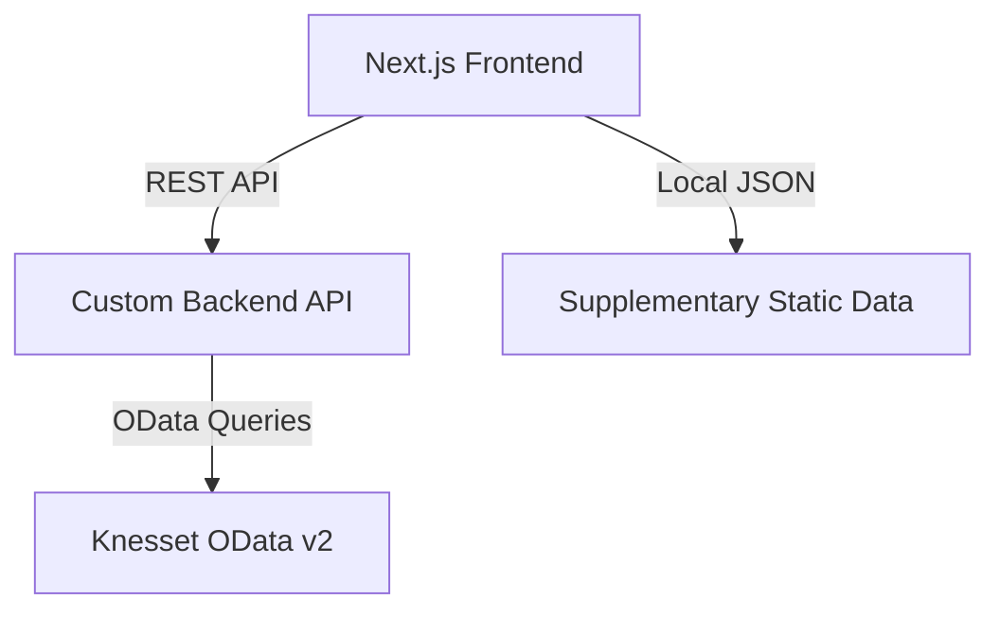

# Open Knesset Architecture

[[File Goal: The HOW (System and Data patterns).]]

## 1. Technical Stack

- **Framework**: Next.js 15 (App Router)
- **Language**: TypeScript 5
- **Styling**: Tailwind CSS + Shadcn UI
- **Data Visualization**: Recharts
- **Backend Integration**: FastAPI wrapper (`https://backend.oknesset.org`) for Knesset OData v2

## 2. Data Flow Architecture

## 3. Key Architectural Concepts

### Unified Member Identification
The system uses `PersonID` from the `KNS_Person` table as the constant identifier for members across all Knesset terms. This ensures a canonical profile for each person, regardless of how many terms they served.

### Data Strategy: API-First
- **API as Source of Truth**: All parliamentary entities (Members, Parties, Bills, Committees, Votes) for all Knesset terms (1-25+) are fetched via the Custom Backend API.
- **Supplementary Static Data**: Data that does not exist in the Knesset OData API (e.g., historical context, lists of wars, or community-added metadata) is stored locally as JSON files in `src/data/static/`.

### Routing Patterns
- **Canonical Routes**: Entities like members (`/mks/[id]`) or bills (`/bills/[id]`) use their global unique identifiers.
- **Hub-Based Pages**: Knesset session pages (`/knesset/[num]`) serve as comprehensive hubs using anchor navigation (`#overview`, `#members`, etc.) to organize data within a single view.

## 4. API & Data Management

### Caching Strategy
| Data Type | Source | Cache Mode | TTL |
| :--- | :--- | :--- | :--- |
| Historical (K1-24) | API | Force Cache | Infinity (Manual reval) |
| Current (K25+) | API | ISR | 1 Hour |
| Supplementary Static | Local JSON | Static | N/A |
| Real-time (Active Bills) | API | Client-side | 0-5 Minutes |

### Type Safety
All API responses are typed using TypeScript interfaces in `src/lib/api/types.ts`, matching the Knesset OData schema (e.g., `Person`, `Bill`, `Committee`).

## 5. Environment Variables
- `NEXT_PUBLIC_API_BASE_URL`: Base URL for the FastAPI backend.
- `NEXT_PUBLIC_CURRENT_KNESSET_NUM`: The numeric ID of the active Knesset term.
